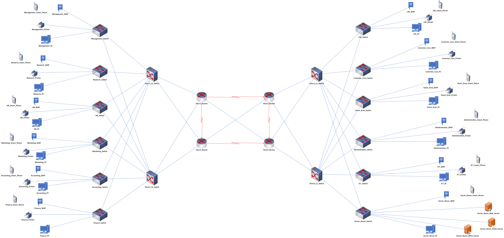

# Bank_Network_Design_Small_Networking_Project

Using MS Visio to model or visualize the network, I completed a modest networking project based on a case study using the Cisco packet tracer tool. I employed a variety of networking technologies, including OSPF, Subnetting, IP addressing, SSH, Routing, Routers, Switches, Multilayer Switches, VLANs, Inter-VLAN Routing, Wireless Access Points, DNS, Basic Network Device Configurations, Hierarchical Network Design and DHCP.

Radeon Company Ltd. is a US-owned company that deals with Banking and Insurance. The company is intending to expand its' services across the African continent having the first branch to be located in Nairobi, Kenya. The company has secured a four-story building to operate withib the Kenyan capital city. Therefore, the company would like to allow sourcing the knowledge from a group of final-year students from the local university to design and implement their company network. Assume you are among the students to take over this role, carefully read down the requirements then model the design and implement the network based on the companys' need. Each floor has departemnts as provided below :

First Floor :-

Departments ==> Management, Research, Human Resource.

Number of PCs ==> 20 in each departements.  

Number of Printers ==> 4 in each departments.

Second Floor :-

Departments ==> Marketing, Accounting, Finance.

Number of PCs ==> 20 in each departements.  

Number of Printers ==> 4 in each departments.

Third Floor :-

Departments ==> Logistics and Store, Customer Care, Guest Area.

Number of PCs ==> 20 in first two departments and 40 in Guest Area.  

Number of Printers ==> 4 in first two departments and 2 in Guest Area.

Fourth Floor :-

Departments ==> Administration, ICT, Server Room.

Number of PCs ==> 20 in first two departments and two Admins' PC in Server Room.  

Number of Printers ==> 2 in first two departments, no printer in Server Room.

Number of Servers ==> Three Servers DHCP, HTTP and Email only in Server Room.

Requirements :

1) Use a software modeling tool to visualize the network topology (consider requirement 3).

 
 
 
 
 
 1.1) Software Modelling Tools:- MS Visio, Visual Paradigm or Draw.io for modelling network design.

2) Use any of the folowing network simualation software to implement the above topology.

 
 
 
 
 2.1) Simaulation Software:- Cisco Packet Tracer (CPT) or GNS3 for design and implementation.
	
 
 
 
 
 2.2) There should be one router in each floor. The router should be connecting switches on that floor.
	
 
 
 
 
 2.3) Use OSPF as the routing protocol to advertise routes.
	
 
 
 
 
 2.4) Each department is required to have a wireless network for the users.
	
 
 
 
 
 2.5) Each department except the server room will be anticipated to have around 60 users both wired and wireless users.
	
 
 
 
 
 
 2.6) Host devices in the network are required to obtain IPv4 addresses automatically.
	
 
 
 
 2.7) Devices in all the departments are required to communicate with each other.
	
 
 
 
 
 2.8) All devices in the network are expected to obtain an IP address dynamically from the dedicated DHCP server located at the server room.
	
 
 
 
 
 2.9) Create  HTTP and E-mail servers.
	
 
 
 
 
 
 2.10) Configure SSH in all the routers and L3 switches for remote login.

3) Use hierarchical network design with redudancy included.

 
 
 
 
 3.1) Having core, distribution and access layers.

4) Configure the basic configuration of the devices.

 
 
 
 
 4.1) Hostnames.
	
 
 
 
 
 4.2) Line Console and VTY passwords.
	
 
 
 
 
 4.3) Banner messages.
	
 
 
 
 
 4.4) Disable domain IP lookup

5) Each department should be in a different VLAN.

 
 
 
 
 5.1) Create VLANs in every department.
	
 
 
 
 
 5.2) VLANs you will use in your case, including VLAN1 also, e.g. 10,20,30..etc.
	
 
 
 
 
 5.3) Each VLAN should be in a different subnetwork.

6) Planning of IP Addresses.

 
 
 
 6.1) You have been given 192.168.10.0 as the base address for this network.
	
 
 
 
 
 6.2) Do subnetting based on the number of hosts in every department as provided above.
	
 
 
 
 
 6.3) Identify subnet mask, usable IP address range, and broadcast address for each subnet.

7) End Device Configurations.

 
 
 
 
 7.1) Configure all the end devices in the network with the appropriate IP address based on the calculations above.

8) Configure port-security.

 
 
 
 8.1) Use sticky command to obtain MAC Address.
	
 
 
 
 
 8.2) Violation mode of the shutdown.

9) Test Communication.

 
 
 
 9.1) Do devices in the same VLAN communicate?
	
 
 
 
 
 
 9.2) Do the devices in different VLANs communicate? 

I utilized Microsoft Visio to model the network, which is shown in the image below.

Video Demonstration :- https://drive.google.com/file/d/1wpncD53NhqPr6vtQe3EKBqxmbOByndvF/view?usp=sharing
